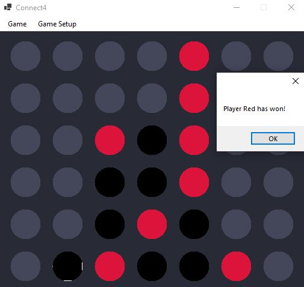

## About
A simple Connect 4 AI that implemented minimax & alpha-beta pruning & move-ordering to fully optimise the AI
The Board for backend and frontend are represented in 1D Immutable List to optimise the code as most Connect4 board state are done with 2D array/list
- ### I wrote this game as I have always wanted to do some simple project in C#, and I figured that doing Connect4 would be a great start as it allows me to learn WinFrms and Data Structure of C#

## Folder Structure

The workspace contains two folders by default, where:

- `engine`: the folder that contains the backend logic of the game
- `gui`: the folder that contains the user interface of the game
- `exe/dll`: the folder that contains executable file

## To play the Game

No. | Steps
--- | ----
1.| User can choose to play as Red/Black
2.| User can choose Red/Black as AI
3.| Or, user can watch AI play against itself

## Game Features

No. | Features
--- | ----
1.| Restart new game
2.| Exit game
4.| Highlight turn
5.| Choose AI level from 1 to 10
6.| Choose AI level from 1 to 5

**Game Screen**

**EXE file**
[Connect4Game](bin/Debug/net5.0-windows/Connect4Game.exe)

**dll file**
[Connect4Game](bin/Debug/net5.0-windows/Connect4Game.dll)